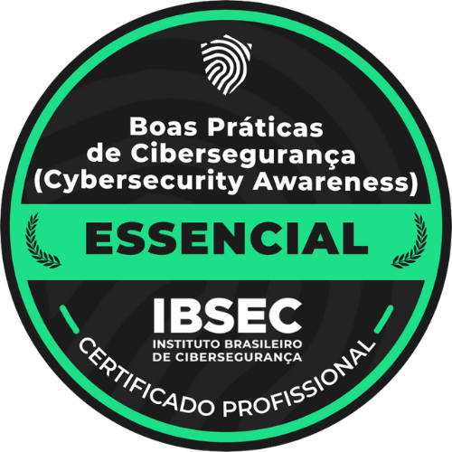
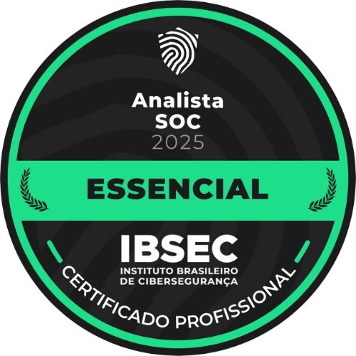
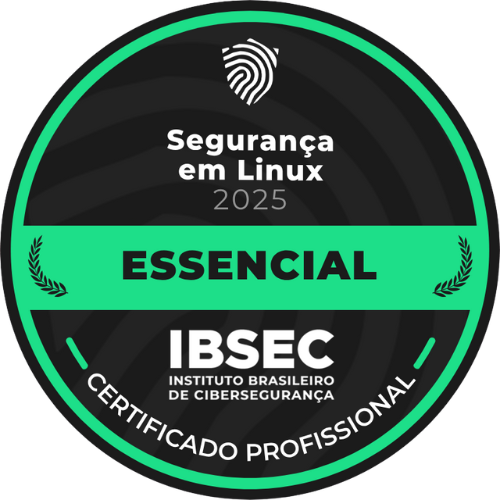
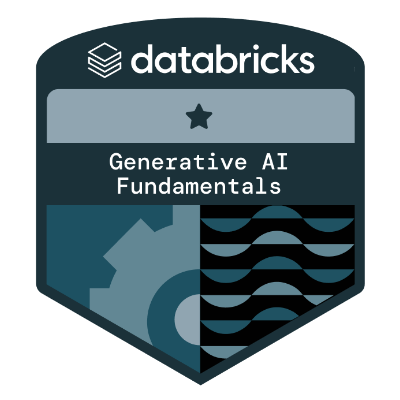
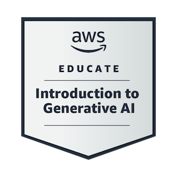
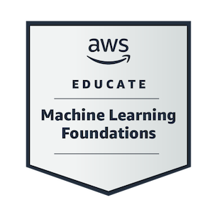
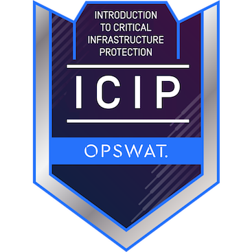

# 👋🏻 Olá, eu sou o Vitor! | Hi, I'm Vitor!

✌🏻 Bem-vindo ao meu perfil do GitHub! Sou apaixonado por tecnologia, sempre em busca de aprender algo novo e encarar desafios!  
✌🏻 Welcome to my GitHub profile! I'm passionate about technology, always looking to learn something new and take on challenges!

🎓 Atualmente, estudo **Sistemas de Computação** e **Análise e Desenvolvimento de Sistemas**, com formação anterior em **Engenharia Mecânica**.  
🎓 Currently, I'm studying **Computer Systems** and **Systems Analysis and Development**, with a previous degree in **Mechanical Engineering**.

💻 Atuo como **desenvolvedor full-stack**, com foco em **Cibersegurança** e **Cloud**, explorando as melhores soluções em **Python, Java, C# e JavaScript**.  
💻 I work as a **full-stack developer**, focusing on **Cybersecurity** and **Cloud**, exploring the best solutions with **Python, Java, C#, and JavaScript**.

🧠 Me aprofundo em **Inteligência Artificial**, **Computação em Nuvem** e **Segurança da Informação** — com projetos práticos, certificações e estudos constantes.  
🧠 I dive deep into **Artificial Intelligence**, **Cloud Computing**, and **Information Security** — through hands-on projects, certifications, and continuous learning.

🚀 Também sou **DIO Campus Expert** e já participei de bootcamps com foco em **IA**, **segurança cibernética** e **desenvolvimento de software** (Microsoft, AWS, Santander, Fortinet, ISC2, Nexa).  
🚀 I'm also a **DIO Campus Expert** and have participated in bootcamps focused on **AI**, **cybersecurity**, and **software development** (Microsoft, AWS, Santander, Fortinet, ISC2, Nexa).

---

## 🔧 Tecnologias & Ferramentas | Technologies & Tools

Aqui estão algumas das linguagens e ferramentas que utilizo no meu dia a dia:  
Here are some languages and tools that I use:

#### Linguagens de Programação | Programming Languages:

#### Desenvolvimento Web | Web Development:

#### FrameWorks e Bibliotecas | Frameworks and Libraries:

 

 

#### Banco de Dados | Database:

#### Outros Conhecimentos | Other knowledge:

#### Ferramentas | Tools:

 

 

---

## 📚 Atualmente, estou aprimorando meus conhecimentos em: | Currently, I'm improving my skills in:

- 🔐 Segurança Cibernética / Cybersecurity  
- ☁️ Computação em Nuvem (Azure & AWS) / Cloud Computing (Azure & AWS)  
- 🧠 Inteligência Artificial com Python / Artificial Intelligence with Python  
- 🧪 Testes e Pentest / Testing and Pentesting  
- 📝 Engenharia de Prompts / Prompt Engineering  
- 📊 Ciência de Dados e Análise de Texto e Imagem / Data Science and Image/Text Analysis  
- 🎯 Preparação para certificações como SC-900, CC (ISC2), Google Cybersecurity e mais!
- 🎯 Preparing for certifications like SC-900, CC (ISC2), Google Cybersecurity, and more!

---

## 📊 Estatísticas do GitHub | Github Stats

---

## 🏅 Certificações | Certifications

---

## 📝 Artigos publicados | Articles (Portuguese only)

Escrevo sobre tecnologia e compartilho conhecimento!  
I write about tech and share knowledge!

Aqui estão alguns dos meus textos:  
Here are some os my articles:

- [Introdução à Sintaxe Básica em Python](https://dio.me/articles/introducao-a-sintaxe-basica-em-python-db2d2fd355fd) 🐍
- [Engenharia de Prompts: Criando Interações Inteligentes com Modelos de IA](https://dio.me/articles/engenharia-de-prompts-criando-interacoes-inteligentes-com-modelos-de-ia-4acc437e73e6) 🤖
- [Computação Quântica: A Nova Revolução Tecnológica e o Estado Topológico da Matéria](https://dio.me/articles/computacao-quantica-a-proxima-revolucao-tecnologica-e-o-estado-topologico-da-materia-f8f82ac4224d) ⚛️
- [Segurança Cibernética: Entenda os Ataques e Aprenda a se Defender](https://dio.me/articles/seguranca-cibernetica-entenda-os-ataques-e-aprenda-a-se-defender-814fe668535b) 🔒

---

## 👥 Conecte-se comigo! | Connect with me!

    

---

## 🫰 Agradecimento | Thanks

🙏 Obrigado por visitar meu perfil! Se gostou dos meus projetos, dê uma estrela ⭐ e siga para acompanhar as novidades! 🚀  
🙏 Thanks for visiting my profile! If you like my projects, leave a star ⭐ and follow me to stay updated! 🚀

---

⚠️ Todos os projetos de segurança são de uso exclusivamente **educacional**.  
⚠️ All security-related projects are for **educational purposes only**.
